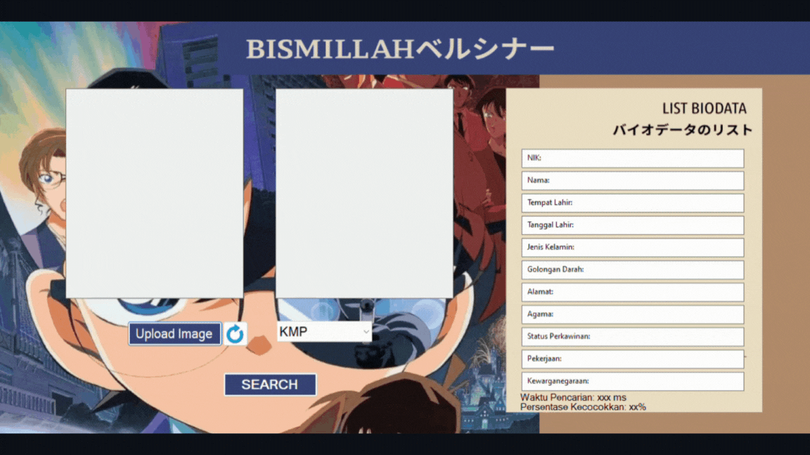

# Tubes3_BismillahBersinar

> This project involves the development of a biometric identification system in C#. The system utilizes fingerprint search functionality and employs two pattern matching algorithms: Knuth-Morris-Pratt (KMP) and Boyer-Moore (BM). KMP enhances search efficiency by preprocessing the pattern to generate a partial match table, while Boyer-Moore optimizes the search process by skipping sections of text based on information gathered during matching, facilitated by the least occurrence table. Additionally, the program utilizes regular expressions for string manipulation, allowing for the conversion of search patterns utilized in database.

## Table of Contents

- [Technologies Used](#technologies-used)
- [Program Requirements](#program-requirements)
- [Setup](#setup)
- [Algorithms](#algorithms)
- [Screenshots](#screenshots)
- [Authors](#authors)


## Technologies Used

- C#
- WinForm(GUI)
- SQLite

## Program Requirements
- .NET - dotnet@8.0.3

## Setup

### To start clone this respository 
```bash
git clone 
```

1. Navigate to this project's directory
```bash
cd src
cd FingerPrintDetector
```
2. To compile all dependencies project run
```bash
dotnet build
```
3. Run Aplication
```bash
dotnet run
```

## Algorithms

### KMP(Knuth-Morris-Pratt)

The Knuth Morris Pratt (KMP) algorithm is to look for patterns in text in left to right order like brute force.

Here is an overview of how BFS works:
1. Build a border function table for the pattern to be searched.
2. Match characters one by one between the fingerprint pattern and the original image pattern.
3. Shift the pattern based on information from the border table when a mismatch occurs.
4. If a match is found until the end of the pattern, return true; otherwise, return false.

### BM (Boyer-Moore)

The Boyer Moore algorithm has two techniques, namely the looking glass and the character jump technique.

Here is an overview of how BM works:
1. Create a last occurrence table for the pattern to be searched.
2. Match the fingerprint pattern with the text using the looking-glass technique.
3. Shift the pattern according to specific rules when a mismatch occurs.
4. If a match is found until the first character of the pattern, return true; otherwise, return false.

## Screenshots

Basic Overview of the Application
<div align="center">
    
</div>

## Authors

| Name                            | GitHub                                           | NIM      |  Contact                     |
| ------------------------------ | ------------------------------------------------- | -------- | ---------------------------- |
| Debrina Veisha Rashika W       | [debrinashika](https://github.com/debrinashika)   | 13522025 | 13522025@std.stei.itb.ac.id  |
| Melati Anggraini               | [mlatia](https://github.com/mlatia)     | 13522035 | 13522035@std.stei.itb.ac.id  |
| Shulha                         | [shulhajws](https://github.com/novelxv)     | 13522087 | 13522087@std.stei.itb.ac.id |
| Miftahul Jannah                | [miftahstudy](https://github.com/miftahstudy)   | 10023500 | 10023500@std.stei.itb.ac.id |
